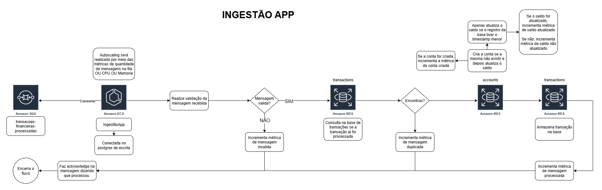

# Desafio Técnico

Este projeto simula um sistema de ingestão e consulta de transações financeiras, utilizando arquitetura de microsserviços, SQS, PostgreSQL com replicação, métricas com Prometheus e Resilience4j para resiliência.

Além disso, optei por duas aplicações separadas, cada uma com sua responsabilidade:

  - A aplicação de ingestão consome as mensagens da fila SQS e realiza operações de criação de contas e atualização de saldos, conectando-se ao Postgres primary para garantir consistência dos dados.

  - A aplicação de consulta é dedicada apenas a fornecer informações aos clientes, conectando-se ao Postgres replica, reduzindo a carga sobre o banco primário e melhorando a performance das leituras.

Essa separação permite manter cada serviço focado em sua função e configurar autoscaling independente: a aplicação de ingestão escala com base na quantidade de mensagens na fila, enquanto a aplicação de consulta escala com base no número de requisições recebidas pelo ALB.

Dessa forma, a arquitetura garante resiliência, consistência e escalabilidade, além de reduzir riscos de impacto entre operações de leitura e escrita.

## Sumário

- [Instruções para executar](#instruções-para-executar)
- [Monitoração](#monitoramento)
- [Diagrama de arquitetura](#diagrama)
- [Banco de dados](#banco-de-dados)
- [Ingestão](#ingestão)
- [Consulta](#consulta)

## Instruções para executar
- Será necessário ter instalado o Docker e o Docker Compose para executar
- Clonar o repositório e acessar, utilizando os comandos: 
  - git clone https://github.com/victorhoffmann/saldos-applications.git
  - cd saldos-applications
- No terminal Executar o comando "docker-compose up -d"
- Os serviços devem subir em seguida:
  - A consulta-app depende do banco replica "healthy" para subir
  - A ingestão-app depende do banco primary "healthy" para subir

**Dica:** Você pode diminuir a quantidade de mensagens na fila e o número de contas nas configs do docker-compose:
  - TOTAL_TRANSACTIONS=300000
  - TOTAL_ACCOUNTS=10000
  - **Caso queira realizar a alteração, lembre-se de rodar o comando "docker-compose down -v" para derrubar os serviços e apagar os volumes, excluir a imagem do "golang" e depois executar novamente o docker-compose up -d** 

### Como realizar a consulta
#### Endpoints principais

- Consulta saldo: GET http://localhost:8080/accounts/{id}
- Consulta transações: GET http://localhost:8080/accounts/{id}/transactions
- Consulta ultima transação: GET http://localhost:8080/accounts/{id}/transactions?last_transaction=true

**Dica:** Uma collection pronta do Postman está disponível na pasta `/collection` do projeto para facilitar os testes dos endpoints.
**Só ajustar o id da consulta, pegando um id valido que logar no docker.** 

## Monitoramento

Utilizei o Actuator para não aumentar a complexidade no momento de gerar métricas. Os principais endpoints de monitoramento disponíveis são:

**Ingestão**
- **Health check:** [http://localhost:8081/actuator/health](http://localhost:8081/actuator/health) — Verifica o status de saúde da aplicação.
- **Prometheus:** [http://localhost:8081/actuator/prometheus](http://localhost:8081/actuator/prometheus) — Exposição das métricas para o Prometheus.
- **Metrics:** [http://localhost:8081/actuator/metrics](http://localhost:8081/actuator/metrics) — Lista todas as métricas disponíveis.

**Consulta**
- **Health check:** [http://localhost:8080/actuator/health](http://localhost:8080/actuator/health)
- **Prometheus:** [http://localhost:8080/actuator/prometheus](http://localhost:8080/actuator/prometheus)
- **Metrics:** [http://localhost:8080/actuator/metrics](http://localhost:8080/actuator/metrics)
## Diagrama

### O que seria necessário para deploy dessa aplicação?




### Estratégia de Deploy

Para mitigar o risco de que um bug impacte todos os clientes, penso na criação de uma pipeline automatizada utilizando o GitHub Actions, implementando etapas de validações, testes e um deploy gradual (Canary).

Etapas do processo:

**1 - Validação do Build:** O código é compilado e verificado quanto a erros de sintaxe e dependências.

**2 - Execução de Testes:** Testes unitários e de integração serão executados para garantir que novas alterações não quebrem as funcionalidades já existentes.

**3 - Verificação de Vulnerabilidades:** Ferramentas de análise de segurança verificam vulnerabilidades em dependências e no código.

**4 - Build do Artefato:** Após todas as etapas de validações, a pipeline gera a imagem Docker da aplicação e a envia para o Amazon ECR (Elastic Container Registry).

**5 - Criação/Alteração do Serviço ECS:** O serviço no ECS Fargate é configurado com múltiplas tasks e auto scaling, garantindo alta disponibilidade.

**6 - Deploy Canary:** A nova versão é liberada gradualmente, inicialmente atendendo apenas uma pequena parte dos clientes.

**7 - Monitoramento:** Durante a implantação, o comportamento da aplicação é monitorado em tempo real. Caso não sejam detectados problemas, o tráfego é aumentado progressivamente até alcançar 100% dos usuários.

**8 - Rollback:** Se algum problema for identificado durante o deploy Canary, é possível interromper o aumento de tráfego e retornar à versão anterior da aplicação, minimizando o impacto para os clientes.

## Banco de dados

Optei pelo postgres, pensando na leitura e escrita separada, fiz algumas pesquisas e percebi que ele trabalha muito bem nesse cenário

Aplicação de ingestão utiliza a primary

Aplicação de consulta utiliza a replica

Estava com dificuldade em ativar a replicação, porém pesquisando mais a fundo encontrei um repo que me salvou: https://github.com/eremeykin/pg-primary-replica

## Ingestão

Nos DTOs do projeto, optei por record para garantir imutabilidade, não precisei criar getter, setter, etc e nem utilizar o lombok, assim mantendo o código limpo e conciso, sem perder integração com validações.

Utilizei o @Bean do jakarta para validações como: NotNull, NotBlank, DecimalMin, Size, Valid.

Como não tenho regras de negócio, optei por não utilizar muitas camadas. Se o projeto crescer (+regras de negócio, +integrações), então sim adicionaria mais camadas/padrões.

Utilizei o Actuator + Prometheus para métricas: http://localhost:8081/actuator/prometheus

Estou utilizando o SQS Listener para consumir as mensagens da fila com:
- 10 concurrency
- 10 messages por poll
- 30 segundos de wait time
- 60 segundos de visibility timeout seconds
- acknowledgement manual

Realizo validações com o Validator do jakarta também para verificar se os campos do DTO de entrada estão conforme o esperado
- Se não passar das validações, incrementa na métrica, faz o acknowledgement.acknowledge() e depois loga a mensagem de erro informado em forma de lista, por exemplo:
  ```json
    {
        "transaction": {
            "id": "12345",            // inválido: não é UUID
            "type": "",               // inválido: @NotBlank
            "amount": 0,              // inválido: @DecimalMin("0.01")
            "currency": "BR",         // inválido: @Size(min=3, max=3)
            "status": "",             // inválido: @NotBlank
            "timestamp": null         // inválido: @NotNull
        },
        "account": {
            "id": "abcde",            // inválido: não é UUID
            "owner": null,            // inválido: @NotNull + @ValidUUID
            "created_at": null,       // inválido: @NotNull
            "status": "",             // inválido: @NotBlank
            "balance": {
            "amount": -10.0,          // inválido: @DecimalMin("0.00")
            "currency": "BRL"         // válido: tamanho = 3
            }
        }
    }
  ```
  ```log
    2025-09-01 23:00:12.123  ERROR 1 --- [ntContainer#0-1] com.itau.ingestao.consumer.SqsConsumer   : Mensagem inválida: [
        transaction.id: ID informado não é um UUID válido,
        transaction.type: must not be blank,
        transaction.amount: must be greater than or equal to 0.01,
        transaction.currency: size must be between 3 and 3,
        transaction.status: must not be blank,
        transaction.timestamp: must not be null,
        account.id: ID informado não é um UUID válido,
        account.owner: must not be null,
        account.created_at: must not be null,
        account.status: must not be blank,
        account.balance.amount: must be greater than or equal to 0.00
    ]
    ```

Da mesma forma valido se a transação já foi processada no banco de dados.
- Se sim, realizo o mesmo processo de incrementar na métrica, faz o acknowledgement.acknowledge() e depois logo o id da transação.

Realizo a criação da conta caso ela não exista na base de dados e depois atualizo o saldo.
- Apenas realizo a atualização de saldo se a transação em processamento for mais recente que a armazenada no banco de dados
- Se não, logo dizendo que o evento é antigo e foi desprezado

Implementei o retry do resilience4j no service, no momento da criação da conta e da atualização de saldo, caso receba uma das duas exceptions do banco de dados/repository
  ```
    - org.springframework.dao.DataAccessException
    - java.net.ConnectException
  ```

Após o processamento de criação de conta e atualização de saldo, armazeno a transação em uma tabela para controle.

Implementei o retry do resilience4j no service, no momento onde ele verifica a existencia da transação e ao salvar a transação, caso receba uma das duas exceptions do banco de dados/repository
  ```
    - org.springframework.dao.DataAccessException
    - java.net.ConnectException
  ```

Por fim, após o processamento com sucesso, logo que a transação foi processada com sucesso, incremento a métrica e faço o acknowledgement.acknowledge();

**Poderia implementar um sistema de lock na tabela para evitar ainda mais a idempotência? Sim, mas pensei no possivel aumento de latência e procurei realizar de outras formas essa redução.**
- Consultando se a transação já foi processada para evitar duplicidade
- Criação da conta com "ON CONFLICT DO NOTHING" caso a conta existir não criar novamente
- Atualização de saldo condicional ao timestamp recebido (se o timestamp for mais recente, então atualiza o saldo)
- Sei que o desafio não pedia, mas também criei uma tabela de transações para ter de histórico também
#### Não fiz por conta do tempo, mas:
- Definir melhor e configurar o Java Args no Dockerfile em relação a memoria, GC, entre outras.
- Poderia implementar um retry com base no número de tentativas e por fim encaminhar para uma fila DLQ
- Poderia implementar o Circuitbreaker para trabalhar em conjunto com os retrys
- Criar os testes restantes do retry/fallback do AccountService e TransactionService para buscar cobertura mais próxima de 100%. 
  - **Observação:** Na aplicação de ingestão, não consegui avançar nos testes de integração do consumo da fila devido à limitação do SQSListener, pois a aplicação depende do Localstack rodando para consumir mensagens. Sem o Localstack ativo, os testes sempre acusam erro, dificultando a automação completa dos testes de integração desse fluxo.

 

## Consulta

Criei dois controllers:
- AccountController para consultar o saldo da conta a partir do id "/accounts/{id}" com validação no campo de id
- TransactionController para consultar as transações da conta a partir do id "/accounts/{id}/transactions" com validação no campo de id e caso queira consultar apenas a ultima a transação passar a query "last_transaction=true"

Nos DTOs do projeto, optei por record para garantir imutabilidade, não precisei criar getter, setter, etc e nem utilizar o lombok, assim mantendo o código limpo e conciso, sem perder integração com validações.

Como não tenho regras de negócio, optei por não utilizar muitas camadas. Se o projeto crescer (+regras de negócio, +integrações), então sim adicionaria mais camadas/padrões.

Utilizei o Actuator + Prometheus para métricas: http://localhost:8080/actuator/prometheus

Ao consultar o saldo da conta:
- Se ao consultar a conta, o parâmetro de id não for um UUID válido então retorna 400:
  ```json
    {
        "message": "ID informado não é um UUID válido",
        "timestamp": "2025-09-02T00:09:15.19-03:00",
        "path": "/accounts/aaaaaaaaaaa"
    }
  ```
- Se a conta não existir na base de dados, incrementa métrica, loga que a conta não foi encontrada e retorna 404:
  ```json
    {
        "message": "Conta não encontrada",
        "timestamp": "2025-09-02T00:09:15.19-03:00",
        "path": "/accounts/f5719012-48c5-422d-b53d-ba2348b77305"
    }
  ```

- Se a conta existir na base de dados, incrementa métrica e retorna 200:
  ```json
    {
        "id": "f5719012-48c5-422d-b53d-ba2348b77304",
        "owner": "68bdb1a0-83bb-4692-9ac0-1f422e3e47a7",
        "balance": {
            "amount": 87.21,
            "currency": "BRL"
        },
        "updated_at": "2025-09-01T23:00:08.033-03:00"
    }
  ```

Implementei o retry do resilience4j no service, no momento da criação da conta e da atualização de saldo, caso receba uma das duas exceptions do banco de dados/repository
  ```
    - org.springframework.dao.DataAccessException
    - java.net.ConnectException
  ```

Ao consultar o transações da conta:
- Se ao consultar a(s) transação(ões) da conta, o parâmetro de id não for um UUID válido então retorna 400:
  ```json
    {
        "message": "ID informado não é um UUID válido",
        "timestamp": "2025-09-02T00:09:15.19-03:00",
        "path": "/accounts/aaaaaaaaaaa/transactions"
    }
  ```

- Se ao consultar a(s) transação(ões) da conta, o parâmetro "last_transaction" não for true ou false então retorna 400:
  ```json
    {
        "message": "Parâmetro 'last_transaction' deve ser true ou false",
        "timestamp": "2025-09-02T00:09:15.19-03:00",
        "path": "/accounts/2e5a767e-2d2e-408d-a564-f4222bf47cc3/transactions"
    }
  ```

- Se consultar todas ou apenas a ultima transação da conta e não existir na base, incrementa métrica e loga que a transação não foi encontrada e retorna 404:
  ```json
    {
        "message": "Transação não encontrada",
        "timestamp": "2025-09-02T00:17:45.981-03:00",
        "path": "/accounts/f5719012-48c5-422d-b53d-ba2348b77305/transactions"
    }
  ```

- Se consultar a todas as transações da conta e existir na base, incrementa métrica e retorna 200:
  ```json
    [
        {
            "id": "23de633d-1ff6-49cf-9322-eccfd78ec13e",
            "account_id": "f5719012-48c5-422d-b53d-ba2348b77304",
            "type": "DEBIT",
            "amount": 48.85,
            "currency": "BRL",
            "status": "REJECTED",
            "timestamp": 1756778408003327,
            "created_at": "2025-09-01T23:00:08.003-03:00"
        },
        {
            "id": "6aafb9f0-b188-4667-aae8-e618f0cf2c41",
            "account_id": "f5719012-48c5-422d-b53d-ba2348b77304",
            "type": "CREDIT",
            "amount": 71.53,
            "currency": "BRL",
            "status": "APPROVED",
            "timestamp": 1756778408030885,
            "created_at": "2025-09-01T23:00:08.03-03:00"
        },
        {
            "id": "3308d333-7605-4136-b2e7-7d2df26b905d",
            "account_id": "f5719012-48c5-422d-b53d-ba2348b77304",
            "type": "CREDIT",
            "amount": 87.21,
            "currency": "BRL",
            "status": "APPROVED",
            "timestamp": 1756778408033155,
            "created_at": "2025-09-01T23:00:08.033-03:00"
        }
    ]
  ```

- Se consultar a ultima transação da conta e existir na base, incrementa métrica e retorna 200:
  ```json
    [
        {
            "id": "3308d333-7605-4136-b2e7-7d2df26b905d",
            "account_id": "f5719012-48c5-422d-b53d-ba2348b77304",
            "type": "CREDIT",
            "amount": 87.21,
            "currency": "BRL",
            "status": "APPROVED",
            "timestamp": 1756778408033155,
            "created_at": "2025-09-01T23:00:08.033-03:00"
        }
    ]
  ```

Implementei o retry do resilience4j no service, no momento da criação da conta e da atualização de saldo, caso receba uma das duas exceptions do banco de dados/repository
  ```
    - org.springframework.dao.DataAccessException
    - java.net.ConnectException
  ```

Realizei os testes com as injeções reais de dependências a partir do controller utilizando o MockMvc + H2 em memória, garantindo não só testes unitários, mas também testes de integração, validando o comportamento dos endpoints e a integração com a camada de persistência.
- Testes de retry/fallback precisei utilizar o mock no repository para forçar o erro (Fiz classe isolada para testar)
- 3 testes do ControllerAdvice precisei fazer o mesmo processo de mock para forçar o erro (Fiz classe isolada para testar)
- Com isso, além de garantir boa cobertura de código, também assegurei que os principais fluxos da aplicação funcionam de ponta a ponta.

 

#### Não fiz por conta do tempo, mas:
- Definir melhor e configurar o Java Args no Dockerfile em relação a memoria, GC, entre outras.
- Poderia implementar uma paginação na consulta de transações (Sei que não foi pedido a consulta de transações no desafio)
- Poderia implementar o Circuitbreaker para trabalhar em conjunto com os retrys